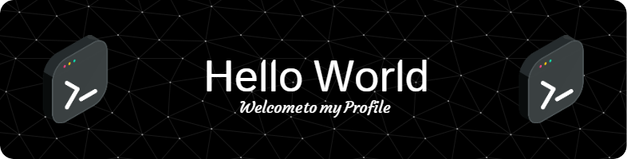

<h1 align="center">Hi 👋, Soy Carlos Fenelon</h1>

  

<!--Languages and Tools Section-->       
<h2 align="center">Tᴇᴄʜ sᴛᴀᴄᴋ & Lᴀᴛᴇsᴛ ʙʟᴏɢs</h2> 
<picture>
  <source media="(prefers-color-scheme: dark)" srcset="./Skills_Animation_Dark.gif">
  <source media="(prefers-color-scheme: light)" srcset="./Skills_Animation_White.gif">
  
</picture>
 

<h3 align="center">Soy Ingeniero en Sistema apasionado a la programación porque es la manera que puedo expresar mi conocimiento y mi creatividad.</h3>

<h3>Languages and Tools 🛠️</h3>

  

    
    
    
    
    
    
    
    
  

  

  

- 🌱 Estoy actualmente aprendiendo sobre el desarrollo web **HTML, CSS & Javascript**

- 👨‍💻 Todos mis proyectos se encuentra aquí en [https://github.com/carlos430](https://github.com/carlos430)

- 📫 Puede contactarme por **carlosfenelonlaureano@gmail.com**

<h3 align="left">Connect with me:</h3>

<h3>My GitHub Trophies 🎖️</h3>

  

<h3>My GitHub Contributions Sumarry ⭐</h3>

&nbsp;

  

